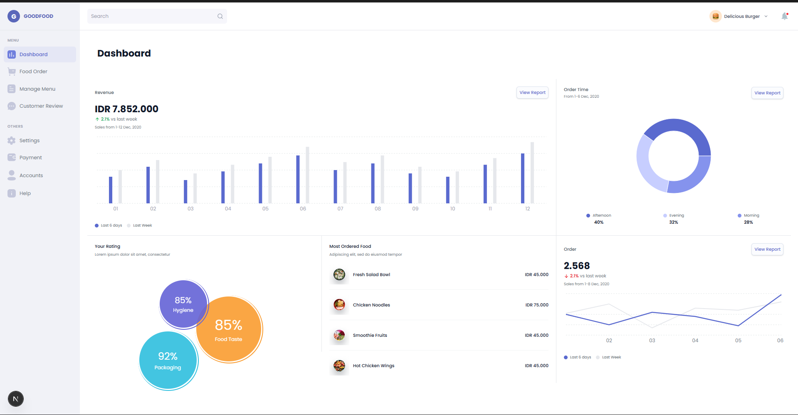

# GOODFOOD - Dashboard

A beautiful and responsive food ordering dashboard that helps restaurant managers track orders, revenue, and customer feedback all in one place.

##  Screenshot



_The main dashboard showing revenue charts, order tracking, and customer ratings_

##  How to Run

### Prerequisites

Make sure you have Node.js installed on your computer. You can download it from [nodejs.org](https://nodejs.org/).

### Getting Started

1. **Install Dependencies**

   ```bash
   npm install
   ```

   This downloads and sets up all the tools needed to run the project.

2. **Start the Development Server**

   ```bash
   npm run dev
   ```

   Open your browser and go to `http://localhost:3000` to see the dashboard.

3. **Build for Production**
   ```bash
   npm run build
   npm start
   ```
   This creates an optimized version ready to deploy.

## Features

- **Dashboard Overview** - See your revenue and orders at a glance
- **Order Tracking** - Monitor orders throughout the day
- **Customer Ratings** - Track food quality, hygiene, and packaging ratings
- **Food Menu Management** - View your most ordered items
- **Responsive Design** - Works great on phones, tablets, and computers

## Technology Stack

### What We Use & Why

| Technology       | Purpose                                       | Why It                                                 |
| ---------------- | --------------------------------------------- | ------------------------------------------------------ |
| **React**        | Builds the interactive parts of the dashboard | Makes the interface smooth and responsive              |
| **Next.js**      | Framework that organizes everything together  | Provides fast loading and easy routing between pages   |
| **TypeScript**   | Adds safety checks to our code                | Helps catch bugs before they happen                    |
| **Tailwind CSS** | Styles the entire dashboard                   | Makes it easy to create beautiful designs quickly      |
| **Recharts**     | Creates charts and graphs                     | Displays revenue and order data in easy-to-read charts |
| **Lucide Icons** | Provides icons for the menu                   | Gives the interface a clean, professional look         |
| **Poppins Font** | Text styling                                  | Creates a modern and readable appearance               |

## Notes

- The dashboard is fully responsive and works on all screen sizes
- The sidebar stays fixed while scrolling through content for easy navigation
- All data shown is sample data for demonstration purposes

## Support

If you run into any issues, check that:

- Node.js is properly installed
- You've run `npm install` to get all dependencies
- Port 3000 is available on your computer
